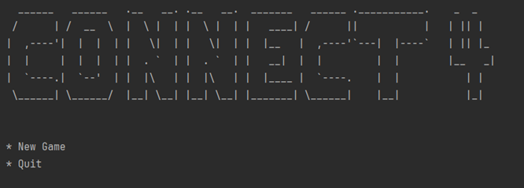
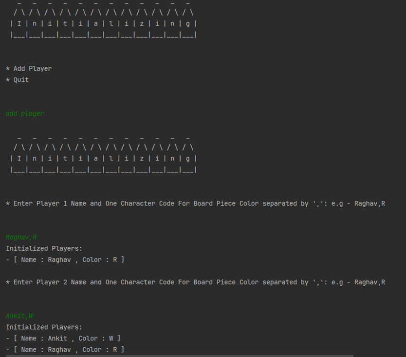

# Connect4 Game in Scala

## Description
This project is a console-based implementation of the classic game Connect4, written in Scala. The game is played on a vertical grid of 6x7, and the goal is to be the first to connect four of your colored discs in a row, column, or diagonal.

## How to Play

Once you start the Game the console will have menu loaded up

### Starting a new Game

Selecting new game will move you to initializing screen where you can add player details

